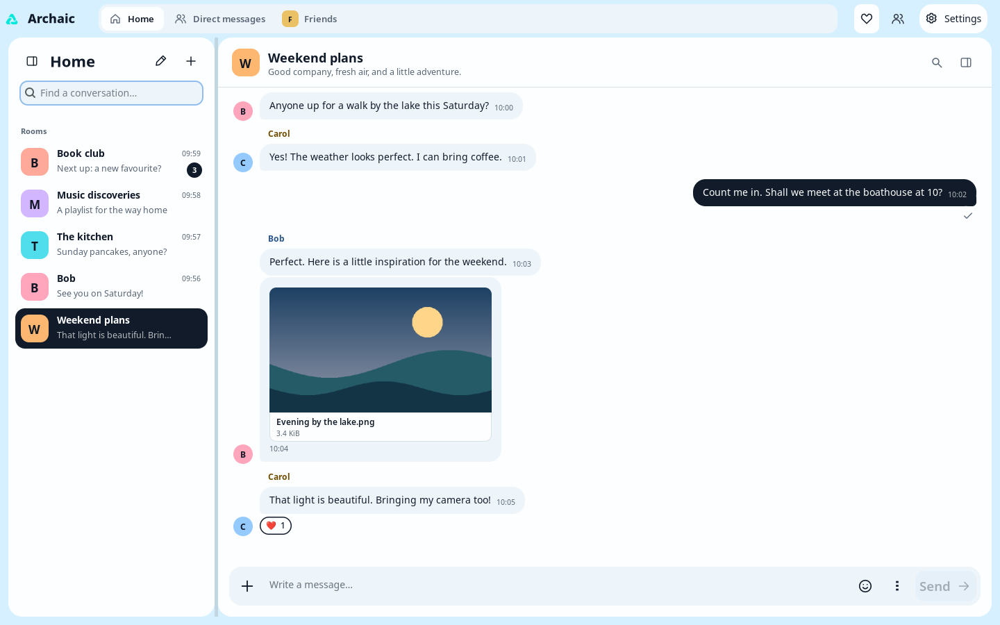
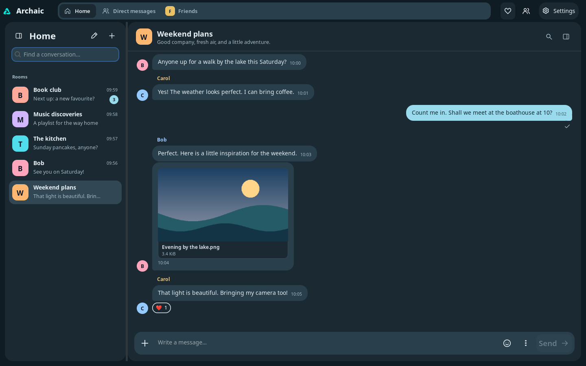
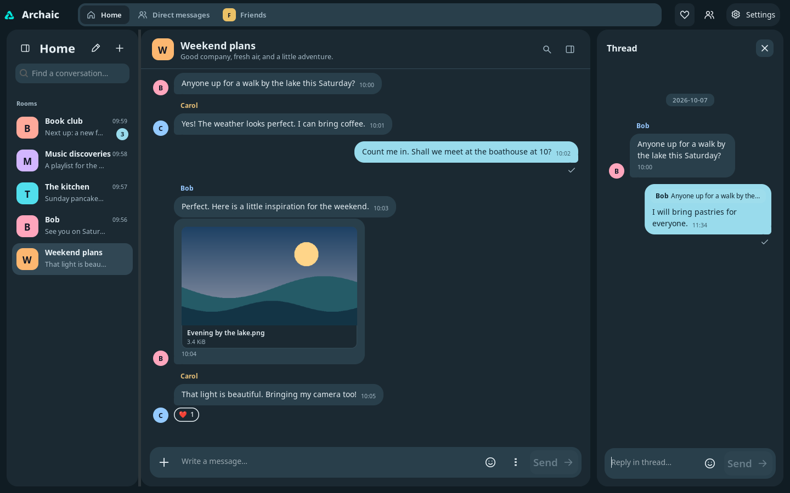
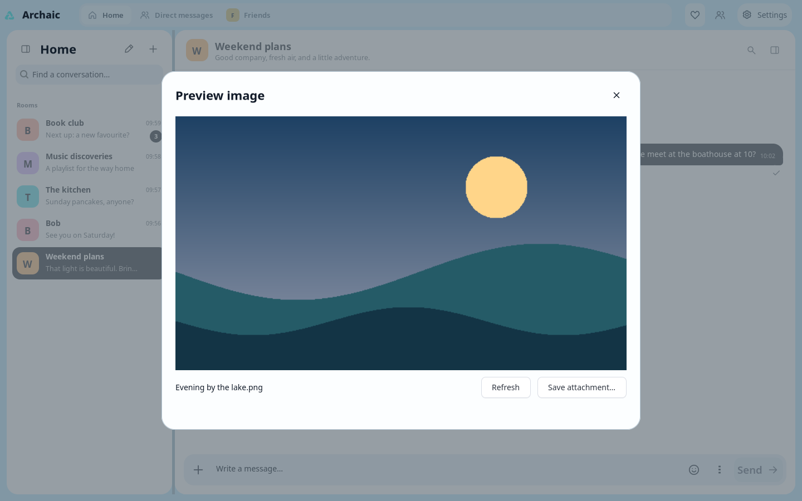
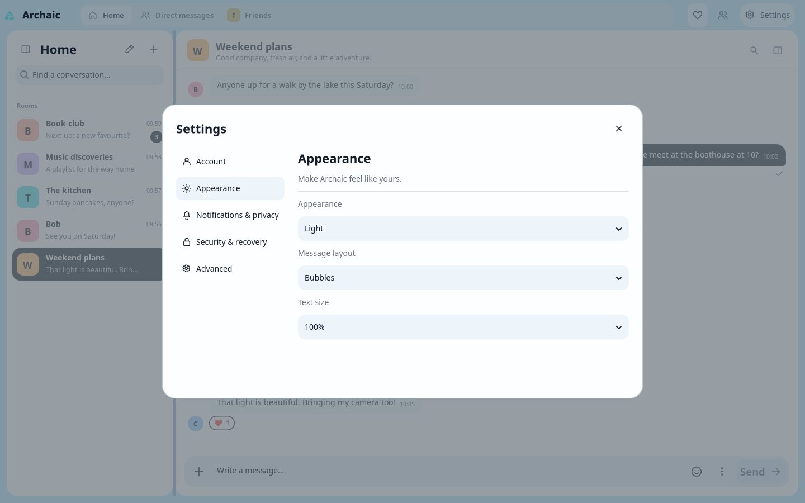

  

<h1 align="center">Archaic</h1>

A native Matrix client for Linux, macOS, and Windows.

## Overview

Archaic brings your Matrix conversations into a native desktop app. Keep up with
friends, follow your communities, and give each conversation room to breathe.

- **Stay organised** with rooms, spaces, direct messages, and favourites.
- **Keep the conversation flowing** with replies, threads, and emoji reactions.
- **Share the moment** with images and files. Click an image to open a larger preview.
- **Make it yours** with light and dark themes and adjustable message density.

Archaic is in active development.

## A look inside

### Your conversations, together

### Just as comfortable after dark

### Keep a side conversation in a thread

### Take a closer look

### Settle into your own style

*Screenshots show Archaic on Linux with sample conversations.*

## Built with CUI

Archaic is written in Rust and built on [CUI](https://github.com/merl111/cui),
a native desktop GUI library written in C. The name is a playful nod to those
“archaic” foundations beneath a modern chat app.
