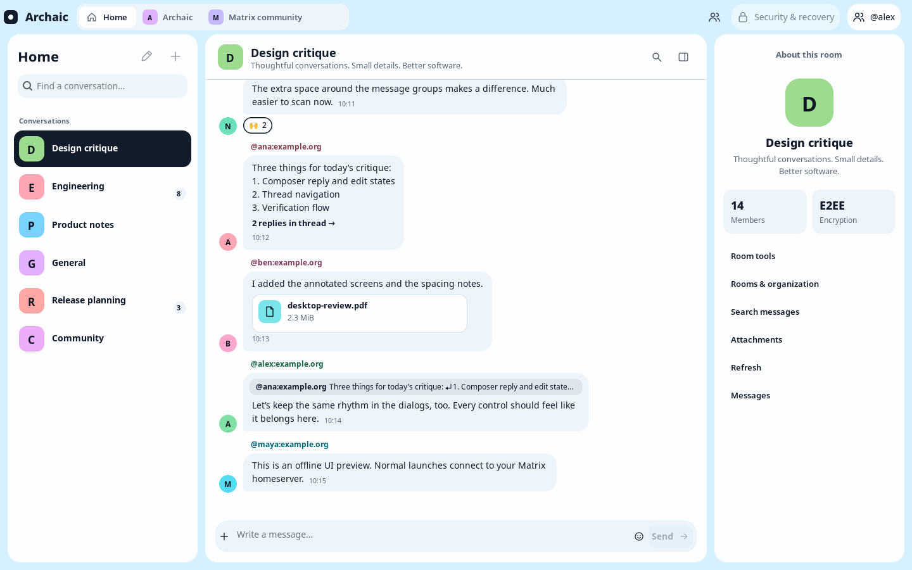
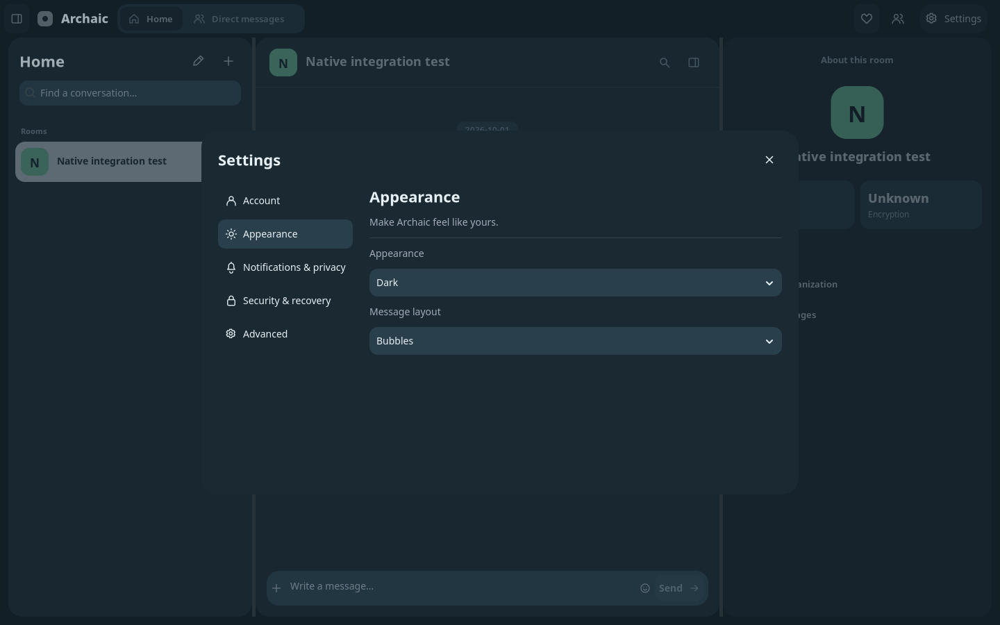
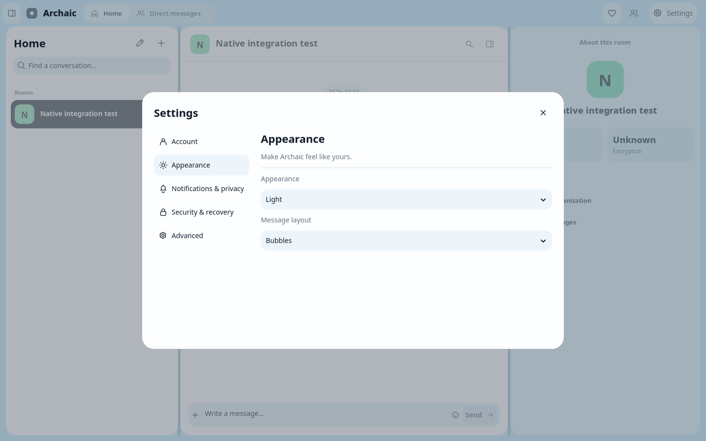
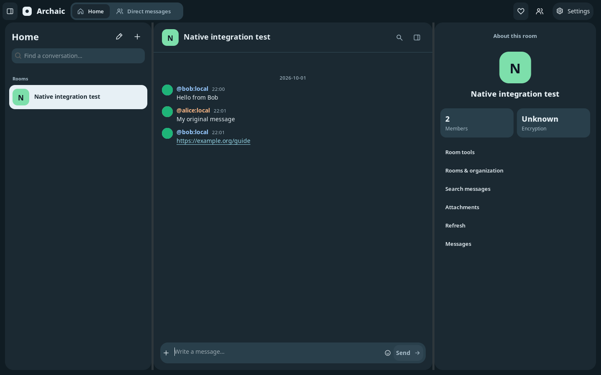
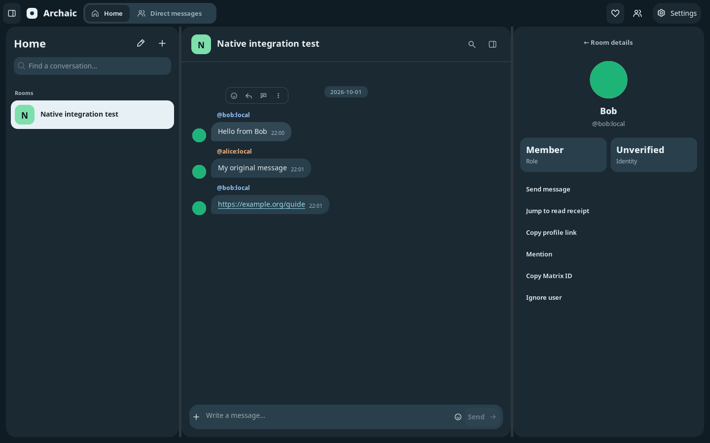

# Daylight native UI

Archaic uses CUI’s actual shared chat components, not a screenshot or web imitation of the Rust Daylight example. The application maps Matrix state into those components and keeps its SDK worker off the GUI thread. CUI and Archaic remain separate repositories; `cui-revision` records the library revision used by the build helper.

## Run

```sh
python3 tools/dev.py run
python3 tools/dev.py run -- --theme dark
python3 tools/dev.py run -- --locale de
python3 tools/dev.py run -- --fixture
```

Close an older running development instance before launching the new executable. Normal startup restores saved sign-in or shows the login card. The explicitly titled offline fixture is only a visual preview; sending is disabled there.

## Conversation navigation

Drag the dividers to resize the conversation list and room inspector. The top-left
panel button hides/restores the list; the panel icon in the conversation header
hides/restores room information. Narrow windows open room information as a dialog.
Space filtering follows synced child-room links, including nested spaces; it does
not join rooms or open administration dialogs. Home restores the full list.

The inspector starts closed, leaving more room for the conversation. Divider
fractions survive hiding, reopening and resizing panes. Conversation rows show
the most recent available message preview and timestamp; thread summaries show
participants and the latest loaded reply. Your messages align to the right in
the bubble layout, with delivery/read indicators attached to their message.

Image messages show an aspect-preserving thumbnail, including queued local
uploads. Click it to open a larger preview with refresh and save controls; close
the dialog with Escape or its close button. Authenticated/encrypted media uses
the existing Matrix SDK transfer path. Background thumbnails are bounded to
512×384, larger previews to 1024×768, and the session retains at most 48 thumbnail
assets. Animated playback and full-resolution zoom are not implemented.

Formatted Matrix text is sanitized into native strong, code, quote, list and
HTTP(S) link spans. Drag across text and use Ctrl/Cmd+C to copy a selection.
Emoji insertion replaces a selection or uses the current composer caret.

Room, sender and account avatars load asynchronously through Matrix SDK media
requests. CUI retains and clips the decoded image; missing images retain initials.
The decoder bounds dimensions and memory, and requests are limited to four at a
time. Avatar refreshes are cached for up to a minute. Member counts use sync
summaries, with a membership lookup when needed instead of reporting an unknown
count as zero. Account settings show the signed-in user's profile image.

These settings expose the implemented preferences; they do not yet cover every
Element preference. Native window verification on macOS and Windows remains pending.

## Native captures

The light/dark previews below use the explicitly offline fixture. Account, emoji and thread screenshots come from the native integration test connected to its private local Matrix fixture. They are application captures, not web renders. Capture metadata is in [provenance.json](images/daylight/provenance.json).



[Dark appearance](images/daylight/dark.png) · [Narrow window](images/daylight/narrow.png) · [Account dialog](images/daylight/account.png) · [Emoji picker](images/daylight/emoji.png) · [Thread pane](images/daylight/thread.png) · [Native More menu](images/daylight/message-more.png) · [Quick reactions](images/daylight/reaction-quick.png) · [Expanded reactions](images/daylight/reaction-expanded.png) · [Reaction search](images/daylight/reaction-search.png) · [Security dialog](images/daylight/security.png)

[Loaded avatars and member count](images/daylight/navigation-avatars.png) ·
[Scrolled conversations](images/daylight/navigation-list-scrolled.png) ·
[Space filter](images/daylight/navigation-space.png) ·
[Settings tabs](images/daylight/navigation-settings.png)

## Controls

| Area | Behavior |
| --- | --- |
| Top bar | Home shows all conversations; Direct messages filters one-to-one Matrix direct chats; space tabs show joined descendant rooms. Settings opens account, appearance, notifications/privacy, security/recovery and advanced tabs. Native window decorations belong to the OS. |
| Room rail | Scroll with the wheel or touchpad; filter, create or join conversations. Invitations, favorites, direct messages and rooms are grouped, with newest message first within each group. The heart button adds/removes the selected conversation from Matrix favorites. Stable IDs include account scope. |
| Message toolbar | React, inline reply, open thread, and a three-dot native menu. Keyboard-focused messages expose the same actions. |
| More / right-click menu | Anchored by CUI to the message action region. React, reply, thread, forward, copy, surrounding history and details; edit/delete for your own messages. Escape and outside click dismiss it. Only actions needing input or confirmation open a dialog. |
| Main composer | Ordinary messages, attachment chooser, emoji picker, reply/edit context, cancellation and pending state. Ordinary drafts survive a reply/edit operation. |
| Thread pane | Replaces the inspector, loads the selected root and relation replies, exposes more relation pages and queues thread replies. Its composer is separate from the ordinary draft. |
| Reaction picker | A CUI popup anchored to the message action shows six quick reactions. The + button expands/collapses the searchable picker in place. Select a common emoji or paste a Unicode sequence. Click an existing reaction to toggle your matching reaction. |
| Inspector | Actual room topic, membership count and encryption state; unknown encryption is distinguished from unencrypted. Links to membership, organization, search, attachments and history. |
| Dialogs | Account switching, appearance, notifications, privacy, deep links, room management, history, search/files, security/recovery and destructive confirmations. Background interaction is disabled while a dialog is open. |

Outside clicks dismiss idle dialogs and the reaction popup; clicks inside keep them open. Escape dismisses the emoji picker or an idle dialog, cancels inline reply/edit, or closes the thread pane. Pending destructive/credential operations retain their existing close guards. Ctrl/Cmd+F opens search, Ctrl/Cmd+Shift+O opens organization and Ctrl/Cmd+Shift+S opens security. See [desktop integration](DESKTOP.md) for the complete shortcut list.

The inspector collapses on narrower windows; room/history controls remain accessible from the top bar. The header’s panel control opens room controls on a narrow window. Dark/light/system changes update native fields and painted chat components together. Fonts and geometry use logical units and the native window scale.

## Boundaries and honest status

- This UI integrates existing Matrix features; it does not establish complete Element parity or production E2EE acceptance.
- The picker contains 56 common emoji with name/shortcode filtering, plus Unicode paste input. It is not a complete Unicode catalog, custom-emote browser, or skin-tone selector. Glyph appearance depends on system fonts.
- Threads are opened from a loaded message or its thread summary. The pane supports relation pagination and the existing live-detail refresh. A global thread inbox, independent per-thread unread navigation, and persistent per-thread drafts are not implemented.
- Search, security and administration retain the existing operation models and acceptance limitations. Rich-text editing, calls and complete Matrix media rendering are separate work.
- Application chrome has English/German catalogs. Some CUI-rendered chat strings and emoji search aliases remain English; RTL and live language switching are still pending.
- Linux GTK has been exercised. Windows and macOS native verification, signing and installer acceptance remain deferred.

## Code map for agents

| Module | Responsibility |
| --- | --- |
| `daylight.rs` | Geometry, surfaces, stable native IDs, palette, room/space/header/inspector projection, dialog layers. |
| `message_menu.rs` | Native CUI menus, permission-sensitive commands and scoped callback targets; no custom popup rendering. |
| `daylight_controller.rs` | Native chat event dispatch to existing controller operations; never overwrite a chat component’s internal callbacks. |
| `daylight_forms.rs` | Shared field/action styling across login, account, security and room forms. |
| `timeline_view.rs` | Bounded NUL-safe Matrix message projection, timestamps, reaction aggregation, thread summaries and render caching. |
| `thread_pane.rs` | Scope-bound thread state, relation-backed timeline, pagination and thread submission. |
| `emoji_picker.rs` | Native picker, searchable choices, Unicode input and scope-checked selection. |
| `view.rs` | Form ownership and model-driven visibility; one focused dialog at a time. |
| `message_state.rs` | Permission checks, action drafts, stable transaction retries and message action results. |

Do not replace the native chat components with a canvas mock or register an `on_action` callback over their internal handler. Drain their event queues. Keep room/event/account scope checks when adding actions. Do not infer encryption from a default boolean, claim an action succeeded before SDK acknowledgement, or discard an ordinary draft when opening a reply.

## Reproducible native validation

Build first, then on Linux with Xvfb, libXtst and ImageMagick:

```sh
xvfb-run -a -s '-screen 0 1600x1050x24' python3 tools/test_daylight_ui.py
xvfb-run -a -s '-screen 0 1600x1050x24' python3 tools/test_daylight_ui.py --navigation
xvfb-run -a -s '-screen 0 1600x1050x24' python3 tools/test_daylight_ui.py --images --theme dark
```

The test starts a private loopback Matrix fixture and the real desktop executable with a temporary in-memory SDK session. It asserts server requests from native sign-in, ordinary sending, inline reply, thread reply, emoji sending, reaction selection/removal and message deletion confirmation; it also exercises search, organization, security and account dialogs. It verifies that an ordinary draft survives sending an inline reply. It never accesses a real homeserver or the desktop credential vault. Screenshots and a runtime log are written to `target/daylight-ui`.

The driver assumes the default GTK font at 100% and uses an isolated 1600×1050 display. Separate captures also exercised a 3840×2160 display at 200%, dark/light appearance and German text. These are native captures, not browser mockups. The full Rust workspace and CUI chat/input/presentation/desktop tests cover the underlying protocol and rendering behavior; native screenshot checks complement them.


### Encrypted history

The room inspector's **E2EE** badge describes room encryption, not whether this
session possesses its message keys. A new login may need verification with an
existing trusted session, or the existing recovery key entered locally under
**Security & recovery → Recovery**. **Room keys** also supports downloading the
room's existing backup and importing an encrypted key export. Do not create or
reset recovery to unlock an existing backup.

Missing-key messages now say **Encrypted message · Unlock history in Security &
recovery** instead of conflating encryption with unsupported content. The SDK
requests missing sessions from an accessible backup after a decryption failure.
Archaic listens for imported/received keys and retries ciphertext retained in its
bounded timeline and open thread/details caches, preserving pagination. Recovery
cannot restore historical keys that no trusted device or backup still possesses.

Regression coverage includes real, locally generated Megolm ciphertext that
becomes readable after key import without a second history request. The native UI
test also runs with `LC_ALL=de_AT.UTF-8` to cover decimal-comma GTK styling,
opaque modal surfaces, outside dismissal, reaction popup expansion/search and
reopening after Escape. Linux popup window shapes cover X11 displays without a
compositor; native Windows/macOS behavior still requires platform verification.

See [local history and appearance](LOCAL-HISTORY.md) for cached startup, background
indexing, profile interactions, the redesigned settings and message layout modes.

### Appearance refresh

The current native settings, compact timeline and member sidebar are shown below
using a private test homeserver (green avatars are fixture image bytes).






## Accessibility and adaptive layout

Settings → Appearance includes a 100%, 125%, 150%, 175% or 200% text-size
preference. Normal launches persist it in `desktop.json`; temporary and fixture
sessions keep it in memory. It affects native controls and the shared CUI chat
renderer. At narrow widths the sidebar starts as a room rail; its toggle and
Ctrl/Cmd+K reopen room search. Space navigation becomes a native picker when the
tabs would not fit. Enlarged Settings uses icon navigation with translated
accessible names and tooltips. Settings → Advanced → Keyboard shortcuts opens
native help with the platform's primary modifier.

English and German catalogs now supply CUI's composer help, reply/edit context,
thread/vote plurals, poll status and delivery labels. Closing application dialogs
restores the previously focused control when it remains available. Reaction
popups restore their message action; inserting an emoji returns to its editor.

Linux verification includes the 900×650 fixture at 100% and 200%, English/light
and German/dark, complete CUI native UX contracts, and workspace unit/protocol
tests. The same shared implementation is used on macOS and Windows, with native
accessibility adapters and native CI regression coverage. This Linux workspace
cannot verify VoiceOver, Narrator or those platforms' native runtime behavior.
