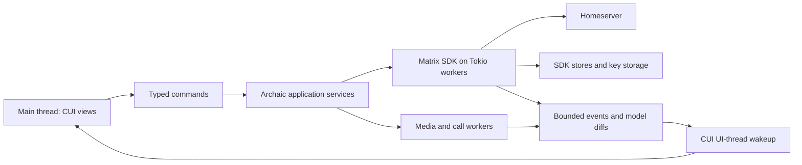

# Archaic implementation plan

Planning baseline: October 1, 2026. No application implementation has started. Target: a polished native Matrix desktop client for Linux, Windows and macOS, with explicit, testable Element feature parity.

## Recommendation

Build Archaic in Rust using CUI's Rust binding, `matrix-sdk` and selected `matrix-sdk-ui` facilities, with Tokio for background work. Keep GTK as CUI's Linux backend and keep the existing AppKit/Win32 backends. Mobile and a new GTK-free backend are outside this project.

The [Matrix Rust SDK](https://github.com/matrix-org/matrix-rust-sdk/tree/b18166c68bb958a21f0bca8b2d8320cb53583362) already provides the Matrix protocol, encryption, state and client-oriented models. `matrix-sdk-ui` provides observable models, not a graphical toolkit, so it can serve a CUI interface. The researched release is 0.19.1, whose workspace requires Rust 1.96 or newer; this machine has Rust 1.98.1. Pin the actual dependency graph and toolchain when creating the application, rather than tracking upstream main. High-level UI APIs and experimental features still need isolation behind our adapters.

Go with [mautrix-go](https://github.com/mautrix/go) is a credible alternative, including encryption, recovery and verification. Rust is preferred here for its existing full-client models and direct access to the SDK used by Element X. Python adds interpreter packaging and another FFI layer; Zig would require adopting another language's Matrix implementation or building more protocol infrastructure. None offers a clear advantage for this application's requested scope.

The no-bundled-dependencies rule remains a CUI library constraint. A real Matrix app necessarily adds networking, crypto, persistence and potentially media dependencies in Archaic. Use maintained libraries for these; do not create cryptographic implementations to minimize a dependency count. Audit the resolved dependency graph, licenses and resulting binary size before release. No Electron runtime is proposed for the main application.

## Reference and definition of parity

Freeze [Element Web/Desktop v1.12.30](https://github.com/element-hq/element-web/releases/tag/v1.12.30), commit `f19cfd9030429240a4209bf5175b372175cf0464`, as the initial target. The reference repository now contains both `apps/web` and `apps/desktop`; the Electron wrapper adds behaviors such as profiles, tray, protocol handling, encrypted search and updates that a web-only audit would miss.

The accompanying inventory maps feature families to implementation phases, prerequisites, acceptance checks and source paths. It is a researched initial map, not a claim that every Element behavior has been manually exercised. Phase 0 expands each family into executable scenarios and checks every reference settings surface against the inventory.

Track three dimensions independently: reference availability, Archaic implementation, and verified platforms. A constructor, screenshot, SDK method or fake data demo is not completion evidence. Stable functionality, release-enabled betas, server-dependent behavior, optional integrations and Labs features must remain distinguishable. Release configuration matters: this release explicitly enables both video-room flags even though their source defaults are false. User status is enabled by its source default. Some Labs prose is older than the source, so it cannot establish actual defaults by itself.

All identified families remain on the roadmap. Milestones are development order, not permission to silently drop calls, widgets, rich composition, recovery or localization. We cannot claim literal parity while any required row is missing; differences need an explicit scope decision and visible documentation.

## Repository and dependency boundary

- **CUI repository:** C99 API, platform backends, all language bindings, generic components, ownership/threading contracts, tests and documentation. Its initial local commit is `6249092`.
- **Archaic repository:** Matrix state, synchronization, cryptography integration, account storage, media/calls, translated copy, desktop application composition, packaging and integration tests.
- Archaic uses only public CUI APIs. Local development may use the sibling `../cui/bindings/rust` path and an explicitly built CUI archive. Release builds pin one CUI commit for both the Rust crate and the C archive. Never pair bindings from one revision with a different ABI.
- Phase 0 adds a reproducible build helper that accepts `CUI_SOURCE_DIR`, validates the pin and configures the library. Fresh CI checks out both repositories at recorded revisions. Later published packages or release archives can replace local paths; no absolute developer path belongs in release metadata.
- Each CUI feature lands and is tested in CUI, then Archaic updates its pin. No copied backend files, embedded fork, Matrix-specific C API, or dependency from CUI back to Archaic.

Proposed Archaic workspace modules:

```text
crates/archaic-app       application entry, native menus, CUI views
crates/archaic-core      account/room models, commands, view-model reductions
crates/archaic-matrix    SDK adapters, authentication, sync, crypto workflows
crates/archaic-storage   app preferences, account isolation, secure-store adapters
crates/archaic-media     attachments, bounded decode/cache, playback/recording
crates/archaic-calls     MatrixRTC and legacy-call integration
crates/archaic-i18n      Fluent catalogs, locale negotiation and formatting
locales/                translator-owned resources
assets/                 original icons and application resources
packaging/              platform manifests, bundles and update configuration
integration-tests/      controlled homeservers, multiple clients, network faults
```

These are proposed boundaries, not a requirement to create empty crates before they are useful.

## Runtime architecture



CUI handles remain on the main thread and remain non-Send. Workers exchange owned data and stable IDs, never widget pointers. The UI dispatcher wakes the event loop, drains a bounded batch, coalesces replaceable updates and cancels work belonging to closed views/accounts. No networking, database operations, media decoding or blocking `await` inside UI callbacks. High-rate typing and progress events may be coalesced; message ordering and send results must not be lost.

Use the SDK's state/event/crypto/media stores rather than inventing a parallel Matrix database. Keep Archaic preferences and view state separate. Persist drafts and outbox state, use stable transaction IDs for retries and reconcile local echoes with server events. Test crash/restart and token refresh, not just clean shutdown.

Use OS-backed credential storage where available: macOS Keychain, Windows-protected credentials, and Linux Secret Service. If the Linux service is unavailable, offer a deliberately designed passphrase-protected store or session-only mode; never silently save tokens or keys as plaintext. Inspect what the SDK encrypts at rest: a crypto store setting is not proof that event history, downloaded media, thumbnails, logs and search indexes are protected. Define retention and logout deletion for each data class.

## Compatibility risks to resolve early

1. **Synchronization:** the pinned high-level [SyncService](https://github.com/matrix-org/matrix-rust-sdk/blob/b18166c68bb958a21f0bca8b2d8320cb53583362/crates/matrix-sdk-ui/src/sync_service.rs) requires MSC4186 support. Discover server capabilities and implement/test a classic `/sync` adapter for older homeservers. Do not assume high-level room-list services automatically fall back. Verify timeline/event-cache behavior on both paths before committing to the adapter design.
2. **Authentication:** implement classic password/SSO and delegated OAuth/OIDC using SDK flows, a system browser and verified callbacks. Check client registration, redirect support, PKCE/state validation, refresh and session revocation. Do not restrict the client to a particular homeserver or assume every server has password login.
3. **Encrypted search:** SDK search is explicitly experimental in this release. Prototype its behavior, storage encryption, migrations, tokenization, redactions and memory use behind an adapter. If it cannot meet requirements, evaluate a maintained local index with explicit encryption; do not imply server search can see encrypted room messages. Display indexing coverage and history limitations.
4. **Calls:** Matrix SDK call event helpers are not a complete audio/video engine. Prototype native MatrixRTC signaling plus a media stack such as [LiveKit's Rust SDK](https://github.com/livekit/rust-sdks). Prove interoperability with Element, including call E2EE, before treating that choice as settled. Legacy Matrix VoIP and Jitsi are distinct compatibility paths. Media/codec dependencies may dominate package size.
5. **Embedded web widgets:** arbitrary Element widgets execute third-party web content. Full in-app compatibility needs a sandboxed browser engine or a separate web host. A native CUI surface cannot run arbitrary widgets. Preferred architecture for literal parity is an isolated optional compatibility host, never the main chat renderer; runtime selection and Linux packaging remain a Phase 0 decision. Opening a widget in the user's browser can be an interim fallback, but is not full embedded-widget parity. This tradeoff needs agreement before a parity release, not a silent omission.
6. **Platform maturity:** existing CUI Windows/macOS code is not equivalent to native verification. Continue development without blocking on that previously deferred work, but require real Windows/macOS tests before Archaic can be advertised as production-ready on them.

## Implementation phases and exits

### P0 — Freeze scope and retire architecture risks

Complete the scenario-level parity checklist from the inventory; retain Element's release configuration as evidence. Establish independent repositories, pinned CUI/SDK builds, a local integration environment, dependency inventory and native build jobs. Prototype OAuth, legacy-versus-sliding sync, secure storage, virtualized rich text, encrypted search and native call interoperability. Decide the widget compatibility policy explicitly. Specify the supported OS/architecture matrix after checking the complete app dependency graph, rather than inheriting CUI's minimum blindly.

Exit: written capability/compatibility results and a repeatable native CUI shell build. Unknowns remain visibly blocked with a concrete next experiment; no optimistic claim of full SDK coverage.

### P1 — Build CUI foundations and the native application shell

Add the dispatcher, safe disposable lifetimes, variable-height virtual views, rich document rendering, enhanced text editing, logical-direction layout and localization hooks. Add the matching CUI Rust wrappers, update other bindings, docs and focused native tests. Build the Archaic shell using the design brief: account/space rail, room list, central timeline and contextual side panel; light/dark, large text and keyboard navigation from the beginning.

Exit: native CUI shell with stress fixtures, stable scroll anchoring, RTL/IME test coverage and bounded widgets/callbacks. This milestone proves the UI infrastructure; it is not the real-client milestone.

### P2 — First real encrypted client

Connect actual accounts and homeservers. Implement discovery, login/restore/logout, sync/fallback, room list, DMs, timeline pagination, durable send/retry/local echoes, typing/read state, encrypted messaging and attachments. Include device verification, cross-signing, key backup/recovery and useful decryption failures in this milestone, not as a final polish task. Add secure session storage and offline recovery.

Exit: Archaic and Element exchange encrypted messages and files, survive restart/disconnect, verify devices, restore history from backup and revoke a session using controlled test accounts. This is the first daily-use candidate, with explicit remaining gaps.

### P3 — Complete daily communication

Deliver rich/Markdown composition, formatting, edits/history, replies, threads, reactions, mentions, emoji, stickers, polls, uploads, voice messages, media viewing/playback and search. Complete per-room drafts, mute/notification settings, attachment policies and keyboard workflows. Implement local encrypted search with honest coverage reporting.

Exit: scenario checks for these workflows pass against Element, including offline retries, redacted/edited messages, long messages, large histories and multiple languages. No mock handlers are accepted.

### P4 — Rooms, spaces and account administration

Complete spaces/hierarchies, discovery, public/private/restricted/knock rooms, invites, power levels, moderation, reporting/blocking, aliases, room upgrades, profile/presence/status and account/security settings. Include identity/integration-server behavior when configured, server notices, retention behavior and exports. Add independent profile/account switching; this improves on Element Desktop's separate-profile approach without mixing cryptographic identities.

Exit: permission-aware administrative operations and failures are verified on controlled servers. Server-dependent features are detected and explained, not represented by dead buttons.

### P5 — Calling and integration parity

Finish native audio/video and screen sharing, device selection, incoming calls, reconnect, PiP, group/video rooms and call E2EE. Implement the legacy/Jitsi/embedded-widget decisions from P0, including capability permission prompts and process isolation. Include server-configured bridge/telephony behavior where the reference offers it; Archaic does not implement server-side bridges or a PSTN service.

Exit: interoperability scenarios run with Element and the required MatrixRTC/TURN/SFU infrastructure; there is no fallback to unencrypted calls without clear user-visible policy. Unsupported widget/call cases remain parity gaps.

### P6 — Localization, platform qualification and release

Translation and accessibility work runs throughout P1–P5; this phase closes coverage. Finish native notifications/tray/dock behavior, deep links, single-instance routing, autostart/preferences, signed updates, packaging, support diagnostics and migration behavior. Test real Windows, macOS and Linux sessions, including Wayland and X11. Ship Linux initially with declared system GTK dependencies, following the user's current packaging choice.

Exit: every mandatory parity scenario passes, platform limitations are documented, translations have review, security-sensitive flows have independent review, and release artifacts have reproducible dependency/size records. Earlier milestones are labelled previews until these gates are satisfied.

## Performance and correctness evidence

Do not promise a size or RAM reduction before measuring. Establish a reference workload and compare the same Element release and Archaic with the same account, history, media cache, OS, hardware and window scale. Publish executable/package size separately from dependencies; measure cold/warm start, idle CPU, total process memory, room-switch latency, first timeline paint, scrolling and call overhead separately.

Start stress fixtures at 1,000 rooms and 100,000 cached events, with mixed rich text, media and edits. These are test workloads, not supported limits. Widget count must track visible rows plus bounded overscan, not history size. Memory must plateau when switching rooms and repeatedly opening/closing views. Set quantitative budgets after P0 measurements rather than presenting invented benchmark results.

Tests: Rust unit/property tests for reducers and serialization; SDK integration tests on disposable homeservers; interop with Element; network disconnect/rate-limit/token-expiry tests; CUI sanitizers and lifecycle tests; untrusted rich-text/media input fuzzing; localization and native accessibility checks. Gate every new reusable component on its actual semantics, not screenshots alone.

## Plan status

This delivery records the initial CUI commit and creates a separate planning repository for Archaic. The plan and inventory are ready for review. No login, network client, UI feature or CUI API proposed here is represented as implemented. No source is copied from Element into Archaic; upstream source/test paths are reference evidence. Licensing of Archaic and CUI should be explicitly selected before distributing either; the current CUI baseline has no top-level license file.
